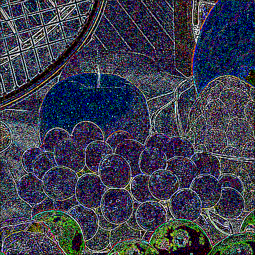
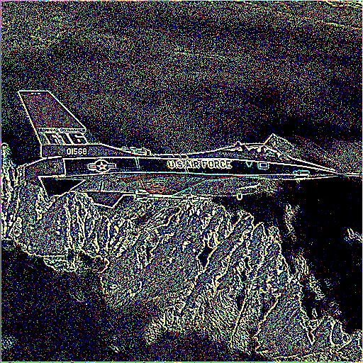
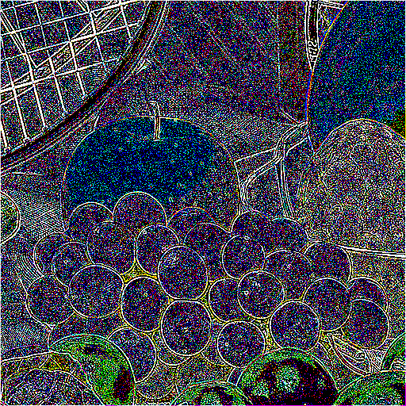

<<<<<<< HEAD
<<<<<<< HEAD
<<<<<<< HEAD
# Convolutional filter(s) for images

* Images are stored in folder images/. All images should be of the same size.

* Python Imaging Library (PIL) was used to convert images into RGB matrices and to convert filtered matrices back to images. PIL was preferred over other C++ libraries 
  due to ease of use.

## Code structure
  * filter.hpp defines a 3-D convolutinal kernel class with a bias term. It contains some helper functions to allocate memory to tensors and to normalize them.
  * conv2d\_layer.hpp defines a convolutional layer. One can set the stride and zero-padding of the filter in this. Also, dimensions of the output layer are calculated
    automatically.
  * conv2d method takes as argument a 3-D data volume and a list of filters (one filter generates one activation map). For example, applying a 3 x 3 x 3 filter on a 512 x 512 x 3 image (with 1 zero padding and 1 stride) will generate an 2-D output layer of 512 x 512. See example (taken from course [cs231n](http://cs231n.stanford.edu/syllabus.html)).
  
  * List of filters would make the output layer. Shape of output layer as well as the data block is returned by the function conv2d.
  
  * main.cpp runs some example filters on a batch of 3 images. It generates 3 filters, one as an edge detector for each color channel (see push\_filter). Then defines
    a convolution layer with given params and applies the layer to each of the images. It then writes the output to a different file.
  * make\_mats.py and load\_img.py are used to generate images\-matrices and vice versa.

```cpp
for (int id = 0; id < num_images; ++id) {
  ...
  auto output = clayer.conv2d(input, filters);
  ...
}
```

## Steps to run
* Compile using make. Build file for convolutional filter demo program is 'main'. See run.sh for a complete run

```bash
rm *.o main
g++  -std=gnu++11 -O2 filter.hpp -o filter.o
g++  -std=gnu++11 -O2 conv2d_layer.hpp -o conv2d_layer.o
g++  -std=gnu++11 -O2 main.cpp -o main
```

* List of images to use is in file make\_mats.py. In the demo it uses a batch of 3  512 \* 512 \* 3 (color) images.

```bash
python make_mats.py img_mats/out.dat
```

* Run the convolutional filter (read from standard input)

```bash
./main img_mats/out.dat img_mats/filter_out.dat < filter.txt
```

* Make output images from matrices

```bash
python load_img.py img_mats/filter_out.dat out_mats
```

## Results
Images taken from [USC Viterbi image dataset](http://sipi.usc.edu/database/database.php?volume=misc)

Input images               |  Output images
:-------------------------:|:-------------------------:
 | 
 | 
 | 

## Reference
Clone by this [link](https://github.com/sshekh/conv-filters)

=======
# Convolutional filter(s) for images

* Images are stored in folder images/. All images should be of the same size. 코드상으로는 512x512 사이즈.

* Python Imaging Library (PIL) was used to convert images into RGB matrices and to convert filtered matrices back to images. PIL was preferred over other C++ libraries 
  due to ease of use.

## Code structure
  * filter.hpp defines a 3-D convolutinal kernel class with a bias term. It contains some helper functions to allocate memory to tensors and to normalize them.
  * conv2d\_layer.hpp defines a convolutional layer. One can set the stride and zero-padding of the filter in this. Also, dimensions of the output layer are calculated
    automatically.
  * conv2d method takes as argument a 3-D data volume and a list of filters (one filter generates one activation map). For example, applying a 3 x 3 x 3 filter on a 512 x 512 x 3 image (with 1 zero padding and 1 stride) will generate an 2-D output layer of 512 x 512. See.
  
  * List of filters would make the output layer. Shape of output layer as well as the data block is returned by the function conv2d.
  
  * main.cpp runs some example filters on a batch of 3 images. It generates 3 filters, one as an edge detector for each color channel (see push\_filter). Then defines
    a convolution layer with given params and applies the layer to each of the images. It then writes the output to a different file.
  * make\_mats.py and load\_img.py are used to generate images\-matrices and vice versa.

```cpp
for (int id = 0; id < num_images; ++id) {
  ...
  auto output = clayer.conv2d(input, filters);
  ...
}
```

## Steps to run
* Compile using make. Build file for convolutional filter demo program is 'main'. See run.sh for a complete run

```bash
rm *.o main
g++  -std=gnu++11 -O2 src/filter.hpp        -o build/filter.o
g++  -std=gnu++11 -O2 src/conv2d_layer.hpp  -o build/conv2d_layer.o
g++  -std=gnu++11 -O2 src/main.cpp          -o build/main
```

* List of images to use is in file make\_mats.py. In the demo it uses a batch of 3  512 \* 512 \* 3 (color) images.

```bash
python3 src/make_mats.py img_mats/out.dat
```

* Run the convolutional filter (read from standard input)

```bash
build/main img_mats/out.dat img_mats/filter_out.dat < configs/filter.txt
```

* Make output images from matrices

```bash
python3 src/load_img.py img_mats/filter_out.dat out_mats
```

## Results
Images taken from [USC Viterbi image dataset](http://sipi.usc.edu/database/database.php?volume=misc)

Input images               |  Output images
:-------------------------:|:-------------------------:
 | 
 | 
 | 

## Reference
Clone by this [link](https://github.com/sshekh/conv-filters)

>>>>>>> cd21a41 (디렉토리 구조 및 README 수정)
=======
# Convolutional filter(s) for images

* Images are stored in folder images/. All images should be of the same size. 코드상으로는 512x512 사이즈.

* Python Imaging Library (PIL) was used to convert images into RGB matrices and to convert filtered matrices back to images. PIL was preferred over other C++ libraries 
  due to ease of use.

## Code structure
  * filter.hpp defines a 3-D convolutinal kernel class with a bias term. It contains some helper functions to allocate memory to tensors and to normalize them.
  * conv2d\_layer.hpp defines a convolutional layer. One can set the stride and zero-padding of the filter in this. Also, dimensions of the output layer are calculated
    automatically.
  * conv2d method takes as argument a 3-D data volume and a list of filters (one filter generates one activation map). For example, applying a 3 x 3 x 3 filter on a 512 x 512 x 3 image (with 1 zero padding and 1 stride) will generate an 2-D output layer of 512 x 512. See.
  
  * List of filters would make the output layer. Shape of output layer as well as the data block is returned by the function conv2d.
  
  * main.cpp runs some example filters on a batch of 3 images. It generates 3 filters, one as an edge detector for each color channel (see push\_filter). Then defines
    a convolution layer with given params and applies the layer to each of the images. It then writes the output to a different file.
  * make\_mats.py and load\_img.py are used to generate images\-matrices and vice versa.

```cpp
for (int id = 0; id < num_images; ++id) {
  ...
  auto output = clayer.conv2d(input, filters);
  ...
}
```

## Steps to run
* Compile using make. Build file for convolutional filter demo program is 'main'. See run.sh for a complete run

```bash
rm *.o main
g++  -std=gnu++11 -O2 src/filter.hpp        -o build/filter.o
g++  -std=gnu++11 -O2 src/conv2d_layer.hpp  -o build/conv2d_layer.o
g++  -std=gnu++11 -O2 src/main.cpp          -o build/main
```

* List of images to use is in file make\_mats.py. In the demo it uses a batch of 3  512 \* 512 \* 3 (color) images.

```bash
python3 src/make_mats.py img_mats/out.dat
```

* Run the convolutional filter (read from standard input)

```bash
build/main img_mats/out.dat img_mats/filter_out.dat < configs/filter.txt
```

* Make output images from matrices

```bash
python3 src/load_img.py img_mats/filter_out.dat out_mats
```

## Results
Images taken from [USC Viterbi image dataset](http://sipi.usc.edu/database/database.php?volume=misc)

Input images               |  Output images
:-------------------------:|:-------------------------:
 | 
 | 
 | 

## Reference
Clone by this [link](https://github.com/sshekh/conv-filters)

>>>>>>> 2488319 (readme update)
=======
# Convolutional filter(s) for images

## 프로젝트 구조
- images
  - Filter를 적용하려는 이미지들이 위치하는 디렉토리
  - color 디렉토리에는 512x512 사이즈의 컬러 이미지가 위치한다.
- img_mats
  - 처리 과정에서 나오는 중간 결과물들이 위치하는 디렉토리
  - outs_img2mat
    - make_mats.py의 결과물이 위치한다. 
    - 원본 이미지를 Matrix 형태로 저장한 파일이 저장된다.
  - outs_apply_filter
    - cpp 프로그램의 결과물이 위치한다.
    - outs_img2mat 디렉토리의 Matrix에 Filter를 적용한 파일이 저장된다.
- result_images
  - load_img.py의 결과물이 위치한다.
  - 최종 결과 이미지가 위치한다.
- configs
  - filter.txt가 위치한다.
- src
  - 프로그램 코드들이 위치한다.

## 프로그램 플로우
- main.cpp, conv2d_layer.hpp, filter.hpp를 빌드하고, 결과물을 Main이라 하겠다.
1. make_mats.py를 실행하여 원본 이미지를 Matrix형태로 변환한다.
    - 명령행 인자로 결과물을 담을 디렉토리와 사용할 코어의 개수를 입력한다.
2. Main을 실행하여 Matrix 파일에 필터를 적용한다.
    - 명령행 인자로 입력 Matrix 디렉토리, 출력 디렉토리, 코어의 개수를 입력한다.
    - StdIn으로 필터를 넣어줘야 한다.
3. load_img.py를 실행하여 필터가 적용된 Matrix파일을 이미지로 변환한다.
    - 명령행 인자로 입력 Matrix 디렉토리와 출력 디렉토리, 코어의 개수를 입력한다.

<br>
---

* Images are stored in folder images/. All images should be of the same size. 코드상으로는 512x512 사이즈.

* Python Imaging Library (PIL) was used to convert images into RGB matrices and to convert filtered matrices back to images. PIL was preferred over other C++ libraries 
  due to ease of use.

## Code structure
  * filter.hpp defines a 3-D convolutinal kernel class with a bias term. It contains some helper functions to allocate memory to tensors and to normalize them.
  * conv2d\_layer.hpp defines a convolutional layer. One can set the stride and zero-padding of the filter in this. Also, dimensions of the output layer are calculated
    automatically.
  * conv2d method takes as argument a 3-D data volume and a list of filters (one filter generates one activation map). For example, applying a 3 x 3 x 3 filter on a 512 x 512 x 3 image (with 1 zero padding and 1 stride) will generate an 2-D output layer of 512 x 512. See.
  
  * List of filters would make the output layer. Shape of output layer as well as the data block is returned by the function conv2d.
  
  * main.cpp runs some example filters on a batch of 3 images. It generates 3 filters, one as an edge detector for each color channel (see push\_filter). Then defines
    a convolution layer with given params and applies the layer to each of the images. It then writes the output to a different file.
  * make\_mats.py and load\_img.py are used to generate images\-matrices and vice versa.

```cpp
for (int id = 0; id < num_images; ++id) {
  ...
  auto output = clayer.conv2d(input, filters);
  ...
}
```

## Steps to run
* Compile using make. Build file for convolutional filter demo program is 'main'. See run.sh for a complete run

```bash
rm *.o main
g++  -std=gnu++11 -O2 src/filter.hpp        -o build/filter.o
g++  -std=gnu++11 -O2 src/conv2d_layer.hpp  -o build/conv2d_layer.o
g++  -std=gnu++11 -O2 src/main.cpp          -o build/main
```

* List of images to use is in file make\_mats.py. In the demo it uses a batch of 3  512 \* 512 \* 3 (color) images.

```bash
python3 src/make_mats.py img_mats/out.dat
```

* Run the convolutional filter (read from standard input)

```bash
build/main img_mats/out.dat img_mats/filter_out.dat < configs/filter.txt
```

* Make output images from matrices

```bash
python3 src/load_img.py img_mats/filter_out.dat out_mats
```

## Results
Images taken from [USC Viterbi image dataset](http://sipi.usc.edu/database/database.php?volume=misc)

Input images               |  Output images
:-------------------------:|:-------------------------:
 | 
 | 
 | 

## Reference
Clone by this [link](https://github.com/sshekh/conv-filters)

>>>>>>> c347834 (설명 추가)
